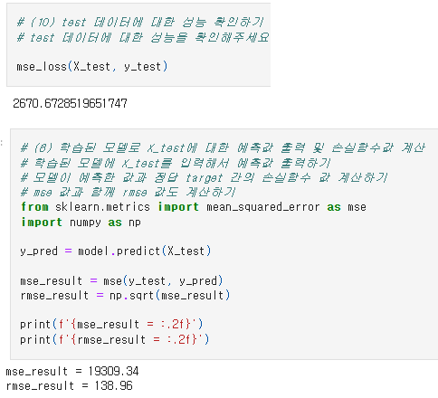
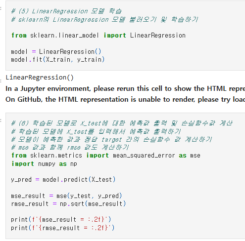
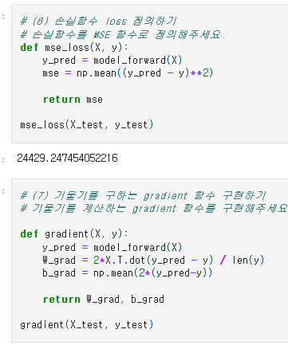

# AIFFEL Campus Online Code Peer Review Templete
- 코더 : 맹성찬
- 리뷰어 : 염철헌


# PRT(Peer Review Template)
- [X]  **1. 주어진 문제를 해결하는 완성된 코드가 제출되었나요?**
    - 문제에서 요구하는 최종 결과물이 첨부되었는지 확인
        - 중요! 해당 조건을 만족하는 부분을 캡쳐해 근거로 첨부
        - 
    
- [X]  **2. 전체 코드에서 가장 핵심적이거나 가장 복잡하고 이해하기 어려운 부분에 작성된 
주석 또는 doc string을 보고 해당 코드가 잘 이해되었나요?**
    - 해당 코드 블럭을 왜 핵심적이라고 생각하는지 확인
    - 해당 코드 블럭에 doc string/annotation이 달려 있는지 확인
    - 해당 코드의 기능, 존재 이유, 작동 원리 등을 기술했는지 확인
    - 주석을 보고 코드 이해가 잘 되었는지 확인
        - 중요! 잘 작성되었다고 생각되는 부분을 캡쳐해 근거로 첨부
        - 
        
- [ ]  **3. 에러가 난 부분을 디버깅하여 문제를 해결한 기록을 남겼거나
새로운 시도 또는 추가 실험을 수행해봤나요?**
    - 문제 원인 및 해결 과정을 잘 기록하였는지 확인
    - 프로젝트 평가 기준에 더해 추가적으로 수행한 나만의 시도, 
    실험이 기록되어 있는지 확인
        - 중요! 잘 작성되었다고 생각되는 부분을 캡쳐해 근거로 첨부
        
- [ ]  **4. 회고를 잘 작성했나요?**
    - 주어진 문제를 해결하는 완성된 코드 내지 프로젝트 결과물에 대해
    배운점과 아쉬운점, 느낀점 등이 기록되어 있는지 확인
    - 전체 코드 실행 플로우를 그래프로 그려서 이해를 돕고 있는지 확인
        - 중요! 잘 작성되었다고 생각되는 부분을 캡쳐해 근거로 첨부
        
- [X]  **5. 코드가 간결하고 효율적인가요?**
    - 파이썬 스타일 가이드 (PEP8) 를 준수하였는지 확인
    - 코드 중복을 최소화하고 범용적으로 사용할 수 있도록 함수화/모듈화했는지 확인
        - 중요! 잘 작성되었다고 생각되는 부분을 캡쳐해 근거로 첨부
        - 


# 회고(참고 링크 및 코드 개선)
```
# 이번 프로젝트는 자전거 대여 수요 예측과 당뇨병 데이터 회귀 분석이라는 두 가지 회귀 문제를 다루는 작업을 진행하였음. 각각의 데이터셋에 대해 전처리, 시각화, 모델링 및 평가를 수행하며, 데이터 분석의 기본 원칙과 머신러닝 모델 학습의 과정을 복습할 수 있었음.
# 이 과정에서 서로 데이터 전처리를 하는 방법이 상이함을 확인하였고, 서로의 방법론을 이해하며 여러 가지로 구현이 가능함을 알 수 있었다.
# 코드 리뷰를 하며 따로 사이트를 찾기 보다는 GPT에게 여러 코드의 기능을 물어가며 진행하였는데, 특히 파이썬 스타일 가이드가 무엇인지 정의를 몰라 검색해보았음
# 개선된 코드는 없으나, 모델을 명시적으로 정의하거나 전처리 과정에서 동일한 결과를 다른 방식으로 구현한 것을 이해하였음.
```
