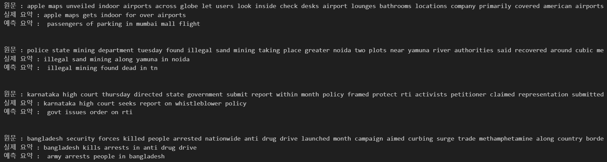
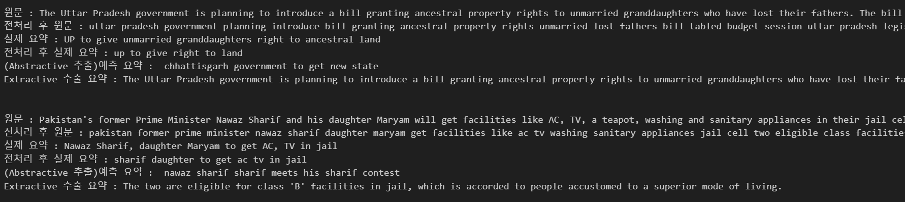

# AIFFEL Campus Online Code Peer Review Templete
- 코더 : 맹성찬
- 리뷰어 : 김인수


# PRT(Peer Review Template)
- [X]  **1. 주어진 문제를 해결하는 완성된 코드가 제출되었나요?**  
      
      
    추상적(abstractive) 요약과 추출적(extractive) 요약을 모두 잘 진행하였습니다.
    
- [X]  **2. 전체 코드에서 가장 핵심적이거나 가장 복잡하고 이해하기 어려운 부분에 작성된 
주석 또는 doc string을 보고 해당 코드가 잘 이해되었나요?**  
    주석이 잘 작성되어 있습니다.  
        
- [X]  **3. 에러가 난 부분을 디버깅하여 문제를 해결한 기록을 남겼거나
새로운 시도 또는 추가 실험을 수행해봤나요?**  
    추출적 요약에서 에러가 있었던 부분을 해결하였고, 원인을 파악하였습니다.

- [X]  **4. 회고를 잘 작성했나요?**
    코드 리뷰를 통하여 추출적 요약과 추상적 요약 수행 과정에서 느낀 점 회고를 잘 마치셨습니다.

- [X]  **5. 코드가 간결하고 효율적인가요?**
    코드는 전반적으로 잘 이해되는 편이며 실험 결과를 확인하기 효율적인 구조로 되어 있습니다.


# 회고(참고 링크 및 코드 개선)
```
문제에서 수행하여야 하는 목표 및 디버깅 등을 성실하게 수행하셨습니다.
```
