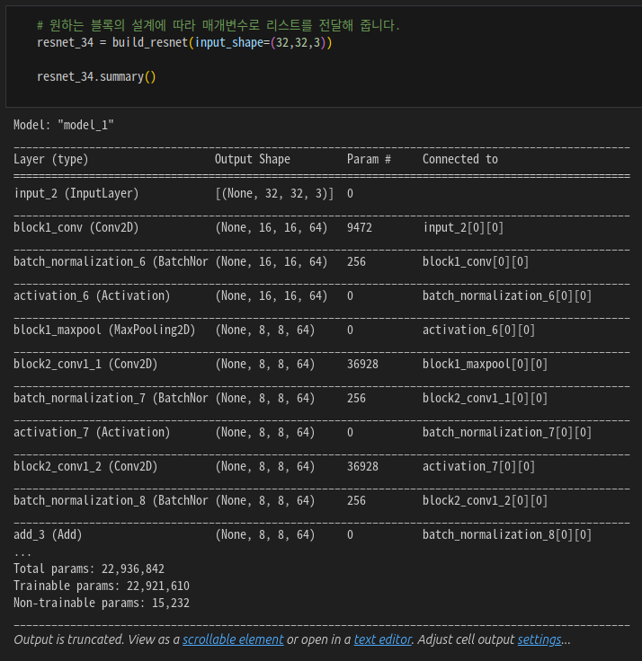
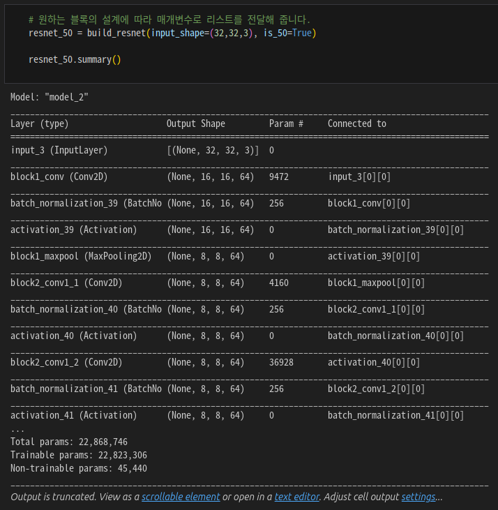
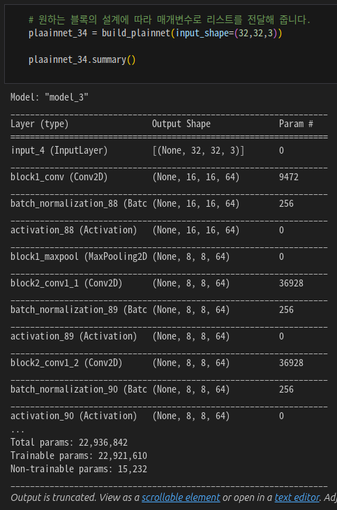
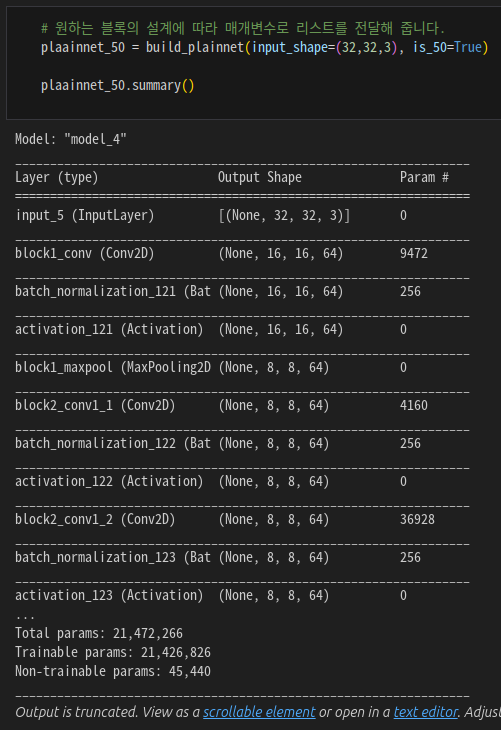
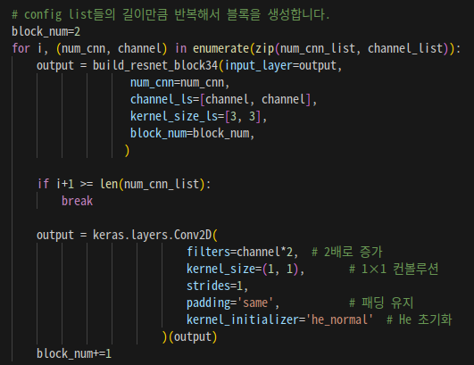
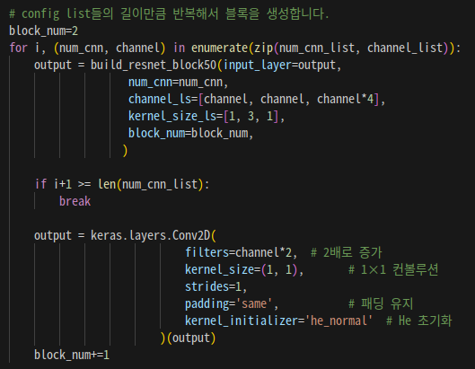
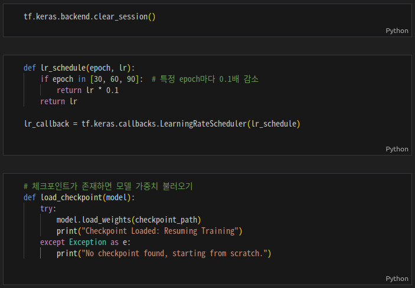
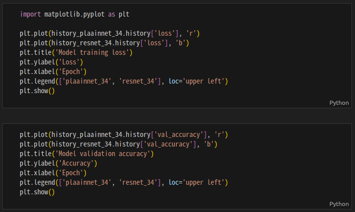

# AIFFEL Campus Online Code Peer Review Templete

- 코더 : 맹성찬
- 리뷰어 : 홍예린

# PRT(Peer Review Template)

- [X]  **1. 주어진 문제를 해결하는 완성된 코드가 제출되었나요?**

  
  
  
  

  - Residual connection을 사용한 모델과 그렇지 않은 모델을 비교하기 위해 4가지 모델을 구성

- [X] **2. 전체 코드에서 가장 핵심적이거나 가장 복잡하고 이해하기 어려운 부분에 작성된
  주석 또는 doc string을 보고 해당 코드가 잘 이해되었나요?**
  
  
  - ResNet block에서 뒤에 있는 bottleneck 1 x 1 conv layer가 `build_resnet50()` 메소드 내부에 위치해 있었는데, 주석을 읽고 이해하기 쉬웠음
  
- [X] **3. 에러가 난 부분을 디버깅하여 문제를 해결한 기록을 남겼거나
  새로운 시도 또는 추가 실험을 수행해봤나요?**
  
  - 모델 학습이 오래 걸려서 추가적으로 learning rate 스케쥴을 설정하고, 모델 체크포인트 콜백을 통해 학습 시킴

- [X] **4. 회고를 잘 작성했나요?**

  - 코드를 작성하며 고민했던 부분과 수정한 부분 등을 알 수 있었음

- [X] **5. 코드가 간결하고 효율적인가요?**
  
  - 전체적으로 간결하고 알아보기 쉬운 코드!

# 회고(참고 링크 및 코드 개선)

```
- 논문 내 ResNet의 learning rate 스케쥴이 어떻게 변화하는지 알 수 있었음
- 학습하면서 고민했던 내용들이 와닿았음
- 수고하셨습니다~~~
```
