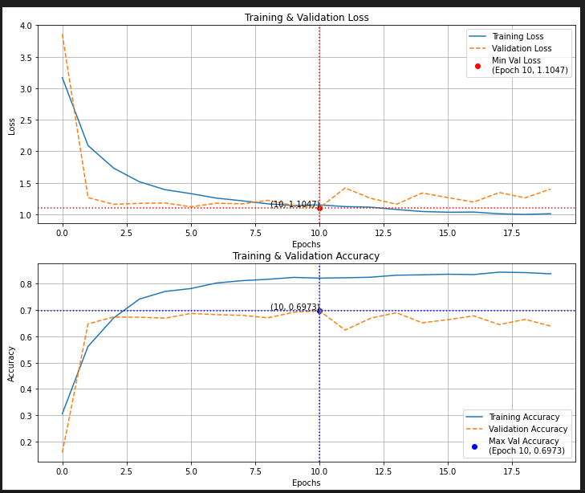
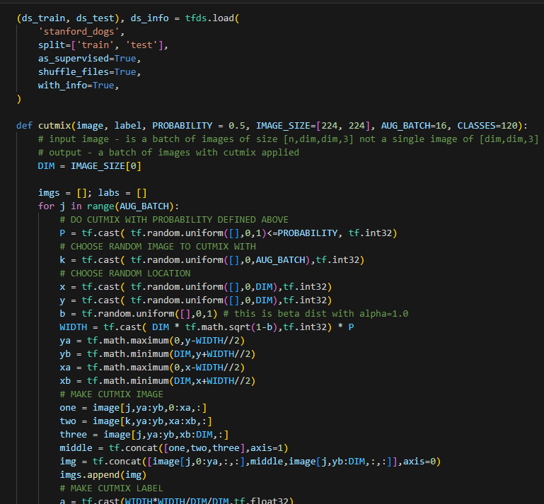
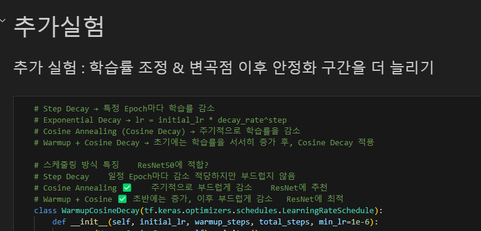
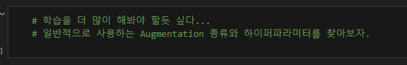
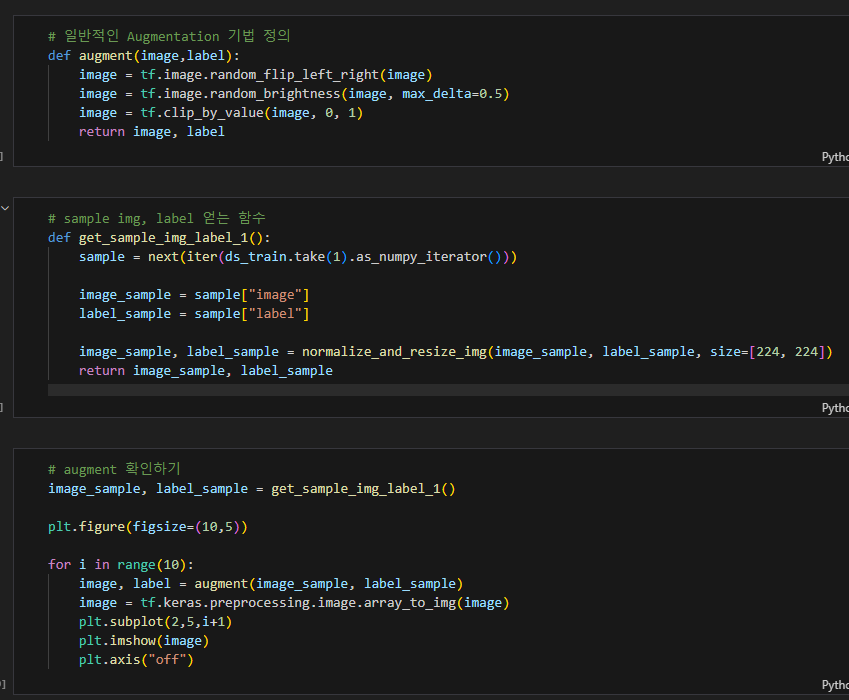

# AIFFEL Campus Online Code Peer Review Templete
- 코더 : 맹성찬
- 리뷰어 : 조성우


# PRT(Peer Review Template)
- [X]  **1. 주어진 문제를 해결하는 완성된 코드가 제출되었나요?**
    - 
    - ResNet50을 활용하여 augmentation을 진행시켰을 때의 학습상황과 최종성적을 그래프를 활용하여 잘 정리하고 있습니다.
    
- [X]  **2. 전체 코드에서 가장 핵심적이거나 가장 복잡하고 이해하기 어려운 부분에 작성된 
주석 또는 doc string을 보고 해당 코드가 잘 이해되었나요?**
- 
- Cutmix augmentation을 직접 구현하여서 코드를 살펴보며 이해해야 하는데 단계별로 구분하여 주석이 달려 있어서 쉽게 이해할 수 있었습니다.
        
- [X]  **3. 에러가 난 부분을 디버깅하여 문제를 해결한 기록을 남겼거나
새로운 시도 또는 추가 실험을 수행해봤나요?**
- 
- 정해진 시간 내에 학습을 해야하는 만큼 자체 스케줄러를 만들어 학습속도를 높이고자 시도하였습니다.
        
- [X]  **4. 회고를 잘 작성했나요?**
    - 
    - 부족한 시간내에 프로젝트를 완수하고 추후에 해야할 것들을 정리하였습니다.
        
- [X]  **5. 코드가 간결하고 효율적인가요?**
    - 
    - 함수를 구현하는 부분과 확인하는 부분을 나뉘어져 있습니다.
    - 실험 전체를 읽으면서 세부적으로 읽어봐야 하는 부분과 결과를 확인하는 부분이 나누어져 있었던게 좋았습니다.


# 회고(참고 링크 및 코드 개선)
```
구현한 내용이 동일하지만 실제로 실험한 방식이 달라 서로 간의 차이점으로 느껴지는게 많았습니다.
Cutmix의 경우 50%만 적용했던게 더 성능이 좋았고, mixup이나 기본 augmentation의 경우 전체를 적용하는게 성능이 더 높게 나왔습니다.
그래서 특정 augmentation을 어떻게 적용하는게 좋은지 어느정도 실험을 통해 확인해야된다는 점을 느꼈고,
Cutmix의 경우 어떻게 적용하는게 좋았었는지 작성된 논문들을 저도 찾아봐야겠다는 생각이 들었습니다.
```
