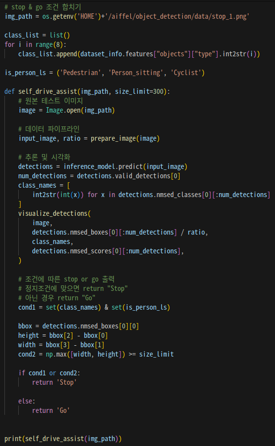
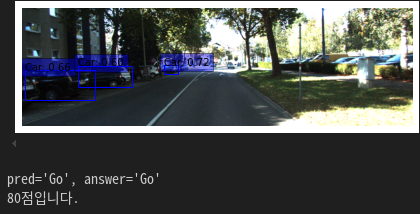
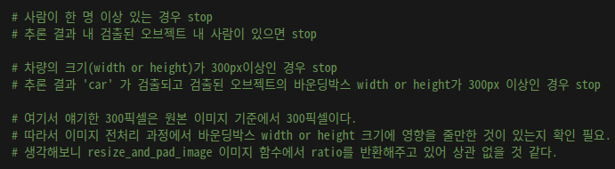
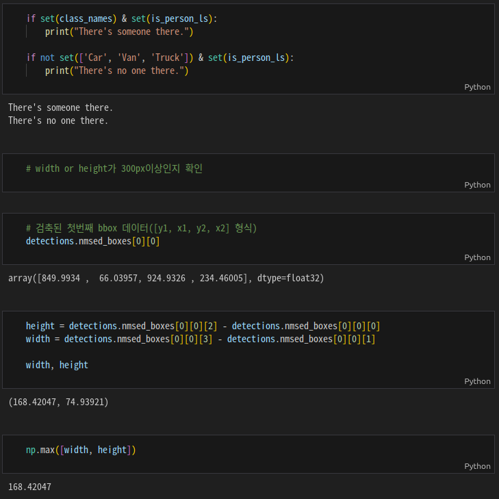
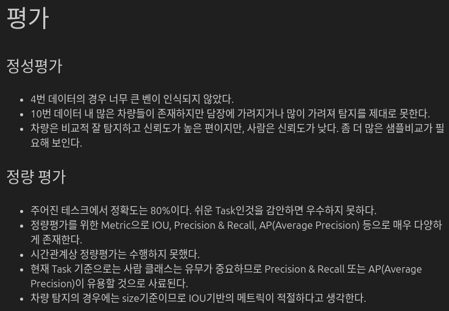
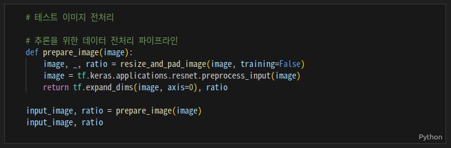

# AIFFEL Campus Online Code Peer Review Templete

- 코더 : 맹성찬
- 리뷰어 : 홍예린

# PRT(Peer Review Template)


* [X]  **1. 주어진 문제를 해결하는 완성된 코드가 제출되었나요?**





- 주어진 사진들에 대하여 `Go`, `Stop`을 출력하는 함수를 정의하고 80점 이상 맞춤


* [X]  **2. 전체 코드에서 가장 핵심적이거나 가장 복잡하고 이해하기 어려운 부분에 작성된
  주석 또는 doc string을 보고 해당 코드가 잘 이해되었나요?**
  

- `Stop` 을 출력하기 위한 로직을 주석으로 남겨서 이해하기 쉬웠음


* [X] **3. 에러가 난 부분을 디버깅하여 문제를 해결한 기록을 남겼거나
  새로운 시도 또는 추가 실험을 수행해봤나요?**



- 함수를 구현하기 위해서 블락 혹은 변수 하나씩 확인 및 디버깅

- [X] **4. 회고를 잘 작성했나요?**
  

- 실험에 대한 평가를 정성 평가와 정량 평가로 나눠서 진행
- 성능에 대한 회고와 개선 방향을 함께 제시


* [X]  **5. 코드가 간결하고 효율적인가요?**



- 사용하지 않는 변수를 `_`로 표현하여 쓸모없는 할당을 줄임

# 회고(참고 링크 및 코드 개선)

```
- 정성 평가와 정량 평가를 나눠서 기록한 것이 인상적
- 메트릭을 비교 분석하여 설명
- 함수 구현 시 고민했던 부분들을 공유해주어 흥미로웠음

```
