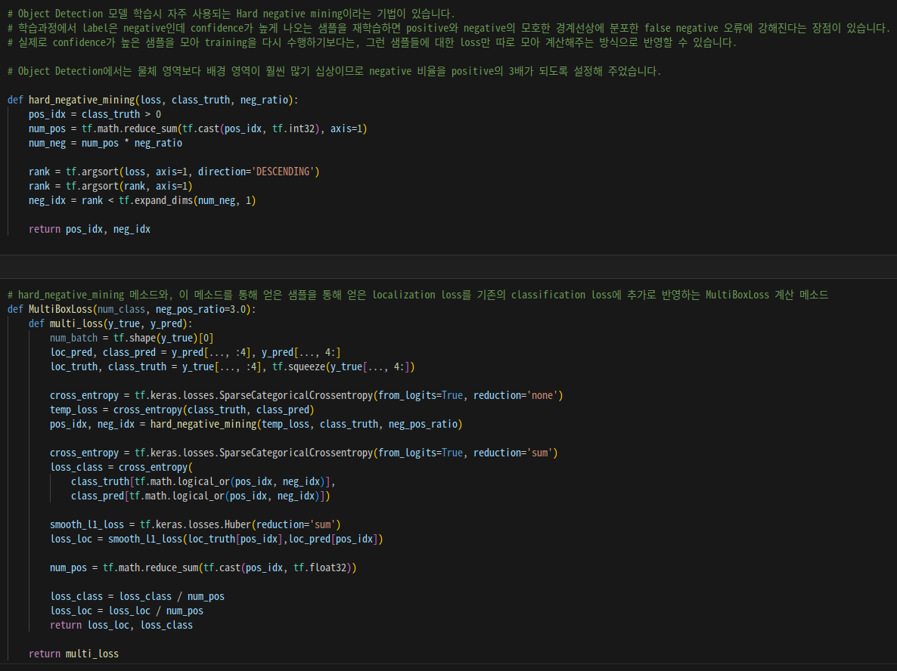
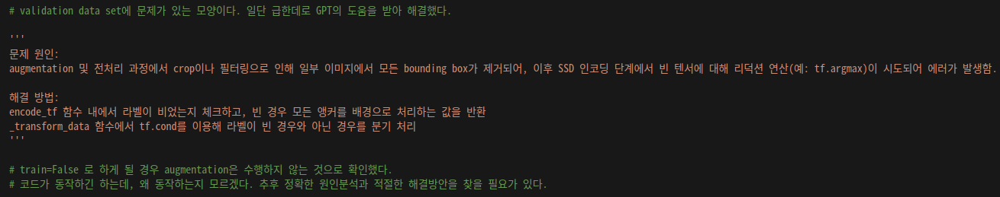
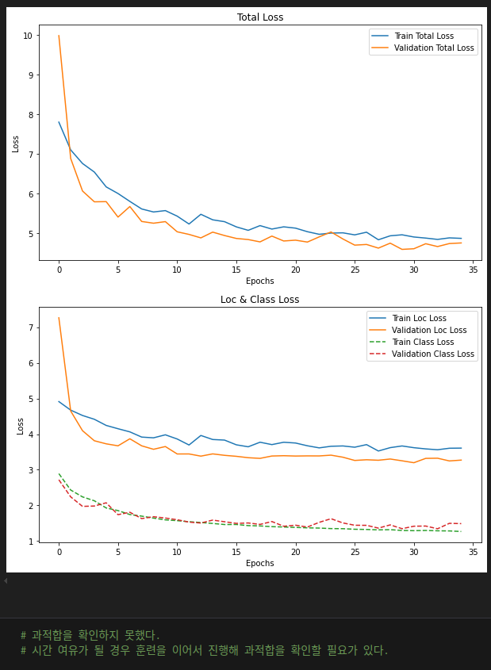
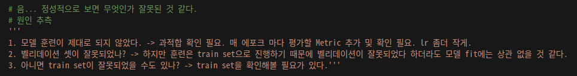
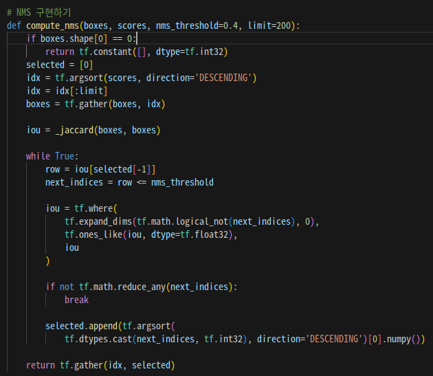

# AIFFEL Campus Online Code Peer Review Templete

- 코더 : 맹성수
- 리뷰어 : 홍예린

# PRT(Peer Review Template)

- [ ] **1. 주어진 문제를 해결하는 완성된 코드가 제출되었나요?**

  - 문제에서 요구하는 최종 결과물이 첨부되었는지 확인
    - 중요! 해당 조건을 만족하는 부분을 캡쳐해 근거로 첨부

- [X] **2. 전체 코드에서 가장 핵심적이거나 가장 복잡하고 이해하기 어려운 부분에 작성된
  주석 또는 doc string을 보고 해당 코드가 잘 이해되었나요?**

    

  - 모델의 로스가 학습의 핵심일 것 같은데, 주석을 남겨놓아 이해가 쉬웠음

- [X] **3. 에러가 난 부분을 디버깅하여 문제를 해결한 기록을 남겼거나
  새로운 시도 또는 추가 실험을 수행해봤나요?**

    

  - 문제 원인 및 해결 방법을 상세하게 기록하여 이해하기 쉬웠음
  - 참고해서 수정해 봐야겠음

- [X] **4. 회고를 잘 작성했나요?**

    
    

  - 실험을 진행하면서 겪은 시행착오를 기록
  - 해결 방안도 함께 제시

- [X] **5. 코드가 간결하고 효율적인가요?**

    

  - 간단하고 알아보기 쉬운 코드를 작성

# 회고(참고 링크 및 코드 개선)

```
- Validation set을 학습에 사용하기 위해서 수정한 코드가 인상적
- 중간 중간에 느낀 점이 많아서 실험할 때 시행 착오를 생생하게 느낄 수 있었음
- 써져 있지 않지만, 더 많은 회고를 말씀해주셨음
```
