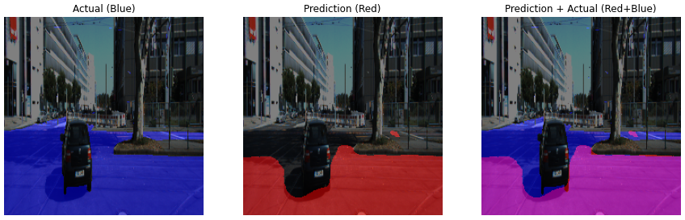
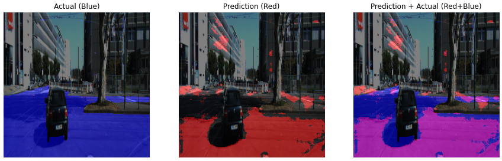
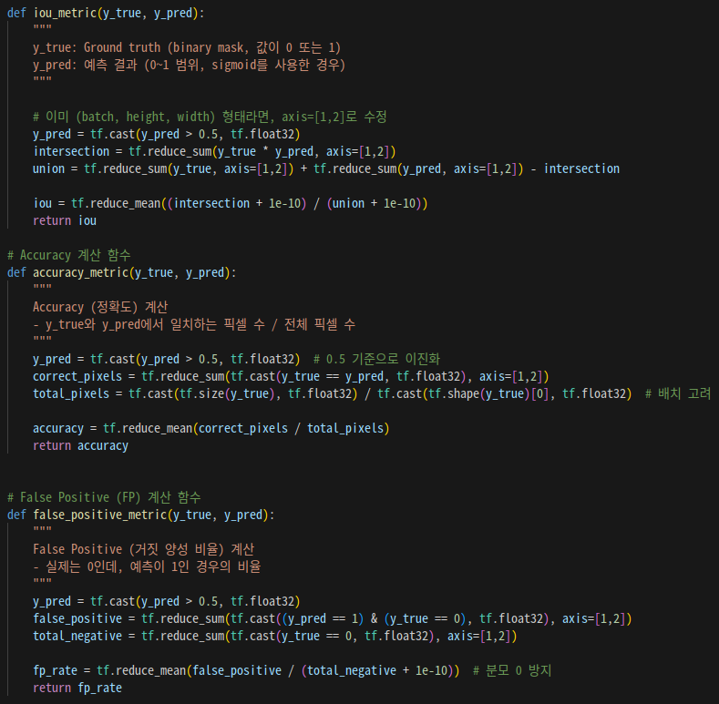
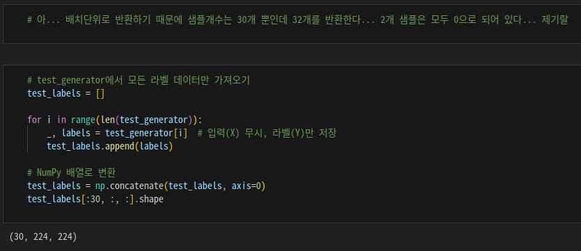
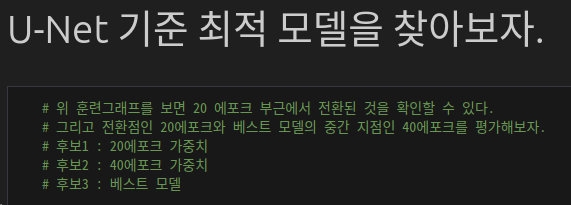
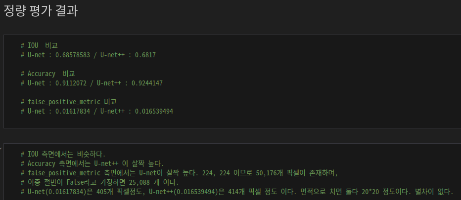
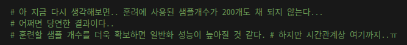
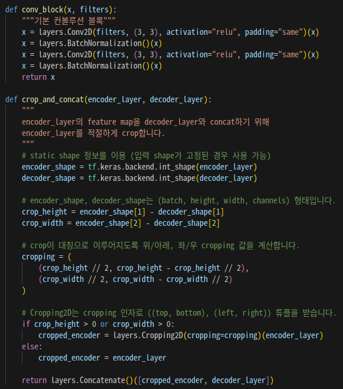

# AIFFEL Campus Online Code Peer Review Templete
- 코더 : 맹성찬
- 리뷰어 : 홍예린


# PRT(Peer Review Template)
- [X]  **1. 주어진 문제를 해결하는 완성된 코드가 제출되었나요?**  
      
      
    - UNet과 UNet++ 모델을 각각 구현하고 학습한 뒤, 결과를 비교하였음
    
- [X]  **2. 전체 코드에서 가장 핵심적이거나 가장 복잡하고 이해하기 어려운 부분에 작성된 
주석 또는 doc string을 보고 해당 코드가 잘 이해되었나요?**  
      
    - 비교에 필요한 메트릭 함수를 정의하고 구현
    - 주석으로 함수에 대한 설명을 남겨서 이해하기 쉬움

- [X]  **3. 에러가 난 부분을 디버깅하여 문제를 해결한 기록을 남겼거나
새로운 시도 또는 추가 실험을 수행해봤나요?**  
      
    - 에러가 난 부분을 분석하고 원인을 찾은 뒤 해결  
      
    - 최적의 모델이라고 판단되는 지점에서 추가 실험을 진행
    
- [X]  **4. 회고를 잘 작성했나요?**  
      
    - 정량 평가에 대한 회고를 기록
      
    - 위 사진 외에도 중간 중간 실험 진행 사항에 대해 기록하고 느낀 점을 남김
        
- [X]  **5. 코드가 간결하고 효율적인가요?**  
      
    - 전체적으로 코드가 간략

# 회고(참고 링크 및 코드 개선)
```
- 그래프에 모델 최적 지점을 찍어서 점선을 그려놓으니 깔끔하고 비교하기 쉬웠음
- 테스트 이미지에도 색깔로 눈에 띄게 표시를 해놓으니 보기가 좋았음
- 다음에 참고해서 시각화 해줘야겠음!!
```
